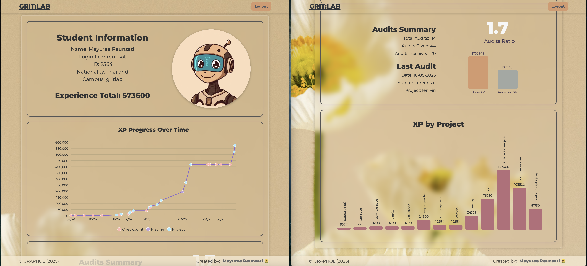

# GraphQL Profile Dashboard

A personal profile dashboard built with JavaScript, GraphQL, and SVG, allowing students to visualize their school journey and achievements. This project demonstrates authentication via JWT, data querying from a GraphQL API, and dynamic SVG graph generation.

---

## Features

- **User Authentication:** Secure login with username/email and password. JWT is used for API access, with error handling for invalid credentials and logout support.
- **Profile Dashboard:** Displays user information (name, login, campus, nationality, etc.) and a summary of audits and XP.
- **Statistics Section:** Visualizes at least two types of statistics using custom SVG graphs (e.g., XP over time, XP by project, audit ratios).
- **Responsive UI:** Clean, modern design with responsive layouts for desktop and mobile.
- **Hosting Ready:** Easily deployable to platforms like Netlify or GitHub Pages.

---

## Table of Contents

- [Getting Started](#getting-started)
- [Project Structure](#project-structure)
- [How It Works](#how-it-works)
- [GraphQL Queries Used](#graphql-queries-used)
- [SVG Graphs](#svg-graphs)
- [Customization](#customization)
- [Deployment](#deployment)
- [Credits](#credits)

---

## Getting Started

### Prerequisites

- Node.js (for local development and static server)
- A modern browser

### Installation

1. **Clone the repository:**
git clone <your-repo-url>
cd <your-repo>

text

2. **Serve the project locally:**
- You can use any static server, e.g.:
  ```
  npx serve .
  ```
- Or simply open `index.html` in your browser.

---

## Project Structure

| File/Folder      | Description                                                                                         |
|------------------|-----------------------------------------------------------------------------------------------------|
| `index.html`     | Main HTML entry point                                                                               |
| `app.js`         | Initializes authentication state, manages view switching between login/profile, handles form submissions and logout events |
| `auth.js`        | Handles login API communication, JWT token management, error handling, and DOM view state transitions |
| `displayData.js` | Renders user data and statistics to the UI                                                          |
| `fetchData.js`   | Executes GraphQL queries with JWT authentication and handles API response parsing                   |
| `graph.js`       | Generates dynamic SVG graphs (line, bar) from transaction data                                      |
| `utils.js`       | Provides date formatting and path manipulation utilities                                            |
| `main.css`       | Styles for dashboard layout, graphs, and responsive elements                                        |
| `auth.css`       | Styling for login page and form components                                                          |
| `assets/`        | Contains static images and branding elements                                                        |


---

## How It Works

1. **Login Flow:**
- The user logs in with their credentials.
- The app sends a POST request to the `/api/auth/signin` endpoint using Basic Auth (base64-encoded credentials).
- On success, a JWT is stored in `sessionStorage` and used for all subsequent GraphQL requests.

2. **Profile Display:**
- After login, the dashboard displays user info, XP, audits, and other stats, fetched from the GraphQL API.
- Data is rendered dynamically into the UI.

3. **Statistics & Graphs:**
- At least two SVG graphs are generated:
  - **Line graph:** Cumulative XP over time.
  - **Bar graph:** XP by project and audit ratios.
- All graphs are responsive and styled for clarity.

4. **Logout:**
- The user can log out at any time, which clears the session and returns to the login view.

---

## GraphQL Queries Used

The app demonstrates several GraphQL query types:

- **Simple queries:** Fetch basic user info.
- **Queries with arguments:** e.g., fetch a specific object by ID.
- **Nested queries:** e.g., fetch user data within audit or result objects.

Example queries (see `fetchData.js` for actual queries):
```
Fetch user info
{
user {
    id
    firstName
    lastName
    login
    campus
    attrs
    }
}
```
```
Fetch XP transactions
{
transaction(where: { type: { _eq: "xp" } }) {
    amount
    createdAt
    path
    }
}
```
```
Fetch last audit for user
query GetLastUserAudit($login: String!) {
    audit(where: { auditorLogin: { _eq: $login } }, order_by: [{ createdAt: desc }], limit: 1) {
    group { path }
    auditorLogin
    createdAt
    }
}
```

---

## SVG Graphs

- **Line Graph:** Shows cumulative XP earned over time, with month labels and proportional X-axis spacing.
- **Bar Graph:** Displays XP earned per project, audit ratios, or other stats, with interactive tooltips and responsive design.

Graphs are generated using pure JavaScript and SVG, without external libraries.

---

## Customization

- **Change displayed info:** Edit `displayData.js` to show additional user fields or stats.
- **Add new graphs:** Extend `graph.js` with new SVG graph types.
- **Style:** Modify `main.css` and `auth.css` for custom themes or layouts.

---

## Deployment

1. **Build:** No build step required; all files are static.
2. **Deploy:** Upload to Netlify, GitHub Pages, or any static hosting provider.

---

## Credits

- [GraphQL API](https://01.gritlab.ax/api/graphql-engine/v1/graphql)
- UI and SVG graph design inspired by modern dashboard principles.
- Built with vanilla JavaScript, HTML, and CSS.

---
*Created by Mayuree Reunsati 🌻  * 
- Mayuree Reunsati : https://github.com/mareerray

---

## Screenshots




---